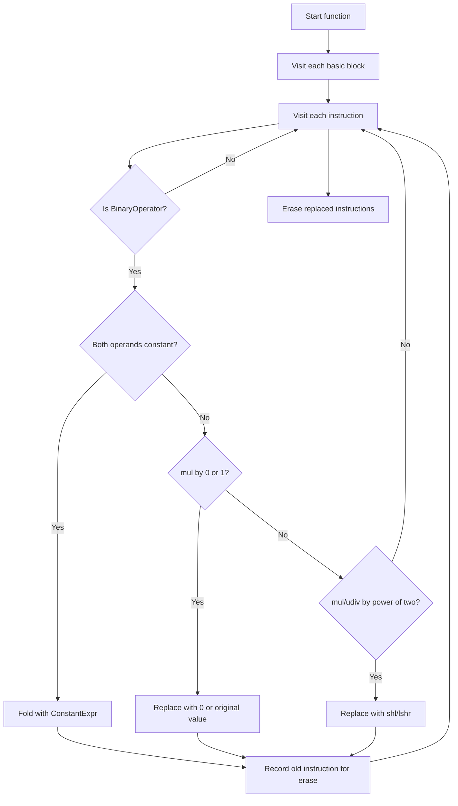

# Design

## Goal

The project goal is to implement a custom LLVM optimization pass that demonstrates three common compiler optimization ideas:

1. constant folding,
2. strength reduction,
3. algebraic simplification.

The pass works directly on LLVM IR and transforms simple integer arithmetic instructions into cheaper or simpler forms.

## High-Level Design

The pass is designed as a function-level optimization. For each function, it walks through every basic block and checks each instruction. Only `BinaryOperator` instructions are considered, because the assignment focuses on arithmetic expressions such as `add`, `sub`, `mul`, and `udiv`.



## Transformations

### Constant Folding

If both operands are constants, the pass evaluates the operation at compile time.

Example:

```llvm
%a = add i32 4, 5
```

Replacement:

```llvm
9
```

The instruction itself disappears if all uses are replaced.

### Strength Reduction

Strength reduction replaces a more expensive operation with a cheaper equivalent operation.

Multiplication by a power of two:

```llvm
%a = mul i32 %x, 8
```

becomes:

```llvm
%a = shl i32 %x, 3
```

Unsigned division by a power of two:

```llvm
%b = udiv i32 %x, 4
```

becomes:

```llvm
%b = lshr i32 %x, 2
```

### Algebraic Identities

The pass also handles two multiplication identities:

```llvm
%a = mul i32 %x, 0
%b = mul i32 %x, 1
```

These become:

```llvm
0
%x
```

## Why a Function Pass?

A function pass is enough because each optimization is local. The pass only needs the current instruction and its operands. It does not need whole-program information, call graph information, or loop analysis.

This design keeps the project smaller and easier to verify. It also matches the way many introductory LLVM assignments expect a pass to be written.

## Alternatives Considered

### Use LLVM's Existing `instcombine`

LLVM already has powerful optimization passes. `instcombine` can perform many of the same simplifications and more. This was not chosen as the main solution because the purpose of the assignment is to implement a custom optimization pass, not only run LLVM's built-in optimizer.

### Use a Module Pass

A module pass can inspect the whole LLVM module at once. That is useful for interprocedural optimization, but this project only needs local instruction rewrites. A module pass would add complexity without improving these transformations.

### Rewrite Signed Division by Powers of Two

Signed division by a power of two looks similar to unsigned division, but it is not always equivalent to an arithmetic shift because signed division rounds toward zero. Arithmetic right shift behaves differently for some negative values. For correctness, this pass does not rewrite `sdiv`.

### Add Many More Algebraic Rules

Rules such as `x + 0 -> x`, `x - 0 -> x`, and `x / 1 -> x` would be useful. They were left out to keep the assignment focused on the requested constant folding and strength reduction behavior. The current code is structured so these rules could be added later.

## Safety Rules

The pass follows these safety decisions:

- It only optimizes integer binary operators.
- It skips non-integer operations.
- It does not fold division or remainder by zero.
- It does not rewrite signed division.
- It records instructions for deletion and erases them after replacement work is complete.

## Expected Impact

The optimization should reduce the number of arithmetic instructions in simple IR examples. More importantly, it should reduce costly multiply and divide instructions by replacing safe cases with shifts or constants.

The evaluation in `EVALUATION.md` measures exactly that: baseline arithmetic instructions compared with optimized arithmetic instructions across five test cases.
