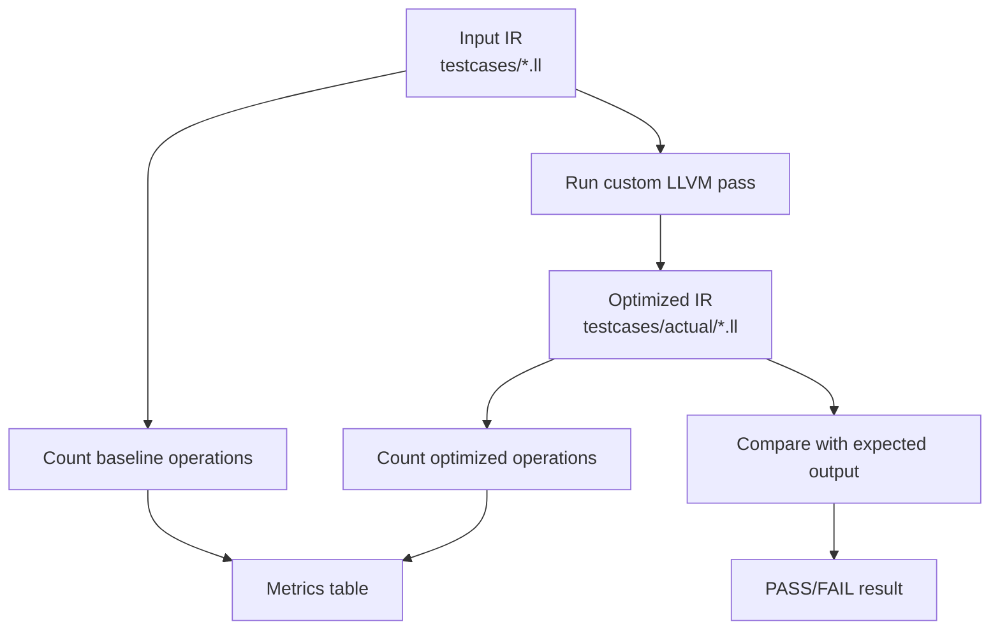

# Evaluation

## Evaluation Goal

The evaluation checks whether the custom LLVM pass actually improves the input IR in measurable ways.

The baseline is the original IR in:

```text
testcases/*.ll
```

The optimized result is generated by:

```bash
./run.sh
```

The script writes optimized IR to:

```text
testcases/actual/*.ll
```

and compares it against:

```text
testcases/expected/*.ll
```

## Evaluation Pipeline



## Metrics

The run script prints these metrics for each test case:

| Metric | Meaning |
| --- | --- |
| `base_ops` | Arithmetic instructions in the original input |
| `opt_ops` | Arithmetic instructions after the pass runs |
| `base_costly` | Original multiply/divide instructions |
| `opt_costly` | Remaining multiply/divide instructions after optimization |
| `shifts` | Shift instructions generated or present after optimization |

The counted arithmetic instructions are:

```text
add, sub, mul, udiv, sdiv, shl, lshr, ashr
```

The counted costly operations are:

```text
mul, udiv, sdiv
```

These are static IR metrics. They are more appropriate than timing measurements here because the test programs are intentionally small and the assignment is about compiler IR transformations.

## Test Cases

The project includes five test cases, satisfying the required minimum of at least five.

| Test case | Purpose | Main expected behavior |
| --- | --- | --- |
| `constant_folding.ll` | Constant-only arithmetic | `add`, `mul`, and `sub` fold into `ret i32 12` |
| `strength_reduction.ll` | Powers-of-two arithmetic | `mul` becomes `shl`; `udiv` becomes `lshr` |
| `combined.ll` | Mixed optimization | Constant `9` and shift by `3` appear in the output |
| `algebraic_identities.ll` | Multiple rules together | `x * 0`, `x * 1`, constants, and power-of-two rewrites all apply |
| `division_strength.ll` | Correctness boundary | `udiv x, 8` is rewritten, but `udiv y, 3` and `sdiv y, 4` remain |

## Baseline vs Optimized Results

| Test case | Baseline arithmetic ops | Optimized arithmetic ops | Baseline costly ops | Optimized costly ops | Shifts after optimization |
| --- | ---: | ---: | ---: | ---: | ---: |
| `constant_folding.ll` | 3 | 0 | 1 | 0 | 0 |
| `strength_reduction.ll` | 4 | 4 | 3 | 0 | 3 |
| `combined.ll` | 3 | 2 | 1 | 0 | 1 |
| `algebraic_identities.ll` | 10 | 5 | 6 | 0 | 2 |
| `division_strength.ll` | 5 | 5 | 3 | 2 | 1 |
| **Total** | **25** | **16** | **14** | **2** | **7** |

## Summary of Improvements

Total arithmetic instructions:

```text
baseline:  25
optimized: 16
reduction: 9 instructions
percent:   36.0%
```

Costly multiply/divide instructions:

```text
baseline:  14
optimized: 2
reduction: 12 instructions
percent:   85.7%
```

Shift instructions after optimization:

```text
7
```

The increase in shift instructions is expected. The pass intentionally replaces safe multiply/divide operations with cheaper shift operations.

## Expected `run.sh` Output Shape

The exact spacing may vary, but the output should look like this:

```text
testcase                     result   base_ops    opt_ops  base_costly   opt_costly   shifts
--------                     ------   --------    -------  -----------   ----------   ------
algebraic_identities         PASS           10          5            6            0        2
combined                     PASS            3          2            1            0        1
constant_folding             PASS            3          0            1            0        0
division_strength            PASS            5          5            3            2        1
strength_reduction           PASS            4          4            3            0        3
TOTAL                        -              25         16           14            2        7
All testcases matched expected output.
```

## Why Some Operations Remain

Not every arithmetic operation should be removed.

In `division_strength.ll`, these operations intentionally remain:

```llvm
%b = udiv i32 %y, 3
%c = sdiv i32 %y, 4
```

`udiv i32 %y, 3` remains because `3` is not a power of two.

`sdiv i32 %y, 4` remains because signed division cannot always be replaced by a shift without changing behavior for negative values.

## Correctness Check

The pass is considered correct for this assignment when:

1. `./run.sh` completes successfully,
2. all five test cases show `PASS`,
3. generated files in `testcases/actual/` match `testcases/expected/`,
4. the metrics table shows the expected baseline and optimized totals.

## Comparison to No Optimization

Without the custom pass, the input IR remains unchanged. That means:

- all constant arithmetic instructions stay in the IR,
- all multiply/divide instructions stay in the IR,
- no expected shift replacements are produced.

With the custom pass, constant-only operations are folded away, safe multiply/divide operations are rewritten to shifts, and simple multiplication identities are removed.
