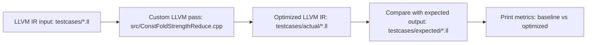

# Constant Folding and Strength Reduction LLVM Pass

## Quick Summary

This repository contains a custom LLVM optimization pass written in C++. The pass reads LLVM IR and performs simple, safe arithmetic optimizations:

1. constant folding for binary integer operations with constant operands,
2. strength reduction for multiplication by powers of two,
3. strength reduction for unsigned division by powers of two,
4. multiplication identity simplification for `x * 0` and `x * 1`.

The main run flow is:

```bash
./run.sh
npm start
```

`./run.sh` automatically builds the pass, runs all provided test cases, compares generated output with expected output, and prints PASS/FAIL results plus metrics.

`npm start` starts the browser frontend so a user can manually paste LLVM IR and compare the output with files in `testcases/expected/`.

## What the Project Optimizes

Example input LLVM IR:

```llvm
define i32 @combined(i32 %x) {
entry:
  %a = add i32 4, 5
  %b = mul i32 %x, 8
  %c = add i32 %b, %a
  ret i32 %c
}
```

Expected optimized LLVM IR:

```llvm
define i32 @combined(i32 %x) {
entry:
  %b = shl i32 %x, 3
  %c = add i32 %b, 9
  ret i32 %c
}
```

In this example:

- `add i32 4, 5` is folded into `9`.
- `mul i32 %x, 8` is replaced with `shl i32 %x, 3`.

## Project Flow



## Repository Layout

```text
.
|-- README.md
|-- DESIGN.md
|-- IMPLEMENTATION.md
|-- EVALUATION.md
|-- CMakeLists.txt
|-- build.sh
|-- run.sh
|-- src/
|   `-- ConstFoldStrengthReduce.cpp
|-- testcases/
|   |-- algebraic_identities.ll
|   |-- combined.ll
|   |-- constant_folding.ll
|   |-- division_strength.ll
|   |-- strength_reduction.ll
|   `-- expected/
|       |-- algebraic_identities.ll
|       |-- combined.ll
|       |-- constant_folding.ll
|       |-- division_strength.ll
|       `-- strength_reduction.ll
|-- frontend/
|-- report/
`-- tests/
```

The official compiler-pass path is `src/`, `testcases/`, `build.sh`, and `run.sh`. The frontend is included as the manual demo path. The `report/` and older `tests/` folders are supplementary reference material.

## Requirements

Use a Linux or WSL environment with LLVM development tools installed.

Required tools:

- `cmake`
- `clang++` or another C++17 compiler
- `opt`
- `llvm-config`
- LLVM CMake package files
- `nodejs` and `npm` for the frontend

Recommended environment:

```text
Ubuntu 22.04 or 24.04
LLVM 16, 17, or 18
CMake 3.16 or newer
```

This project was originally verified with LLVM 18 on Ubuntu 24.04 through WSL.

## Windows Users: Use WSL/Ubuntu, Not PowerShell

On Windows, run this project from a WSL/Ubuntu terminal. Do not run the LLVM build commands from regular PowerShell or Command Prompt unless you have a full native LLVM/CMake toolchain configured manually.

To install WSL with Ubuntu, open PowerShell as Administrator and run:

```powershell
wsl --install -d Ubuntu
```

Restart the computer if Windows asks you to. Then open Ubuntu from the Start menu once and finish the username/password setup.

To use WSL inside VS Code:

1. Install the VS Code extension named `WSL` from Microsoft.
2. Open VS Code.
3. Press `Ctrl+Shift+P`.
4. Run `WSL: Connect to WSL`.
5. Open this repository folder from the WSL VS Code window.
6. Open `Terminal` -> `New Terminal`.

The terminal prompt should look like a Linux shell, not PowerShell. For example, commands such as `sudo`, `chmod`, and `./run.sh` should work there.

If `sudo` asks for a password, enter the Ubuntu/WSL password created when Ubuntu was first set up. Linux terminals do not show characters while the password is being typed.

If that password is forgotten, open Windows PowerShell and start WSL as root:

```powershell
wsl -u root
```

Then reset the Ubuntu user's password:

```bash
passwd <name>
exit
```

After that, return to the VS Code WSL terminal and rerun the setup commands.

## Fresh Clone and Run Instructions

Follow these steps from a WSL/Ubuntu terminal. If the repository is already cloned, skip the first two commands and make sure the terminal is inside the repository root.

### 1. Clone the Repository

```bash
git clone https://github.com/abhay271/IR-Optimization-Pass.git
cd IR-Optimization-Pass
```

### 2. Install Packages

```bash
sudo apt update
sudo apt install -y cmake ninja-build clang llvm-18 llvm-18-dev llvm-18-tools nodejs npm
```

### 3. Add LLVM Tools to PATH

```bash
export PATH=/usr/lib/llvm-18/bin:$PATH
```

Check that LLVM is available:

```bash
opt --version
llvm-config --version
```

### 4. Run the Automated Test Script

```bash
chmod +x build.sh run.sh
./run.sh
```

`./run.sh` automatically:

1. builds the LLVM pass,
2. runs every input in `testcases/*.ll`,
3. writes generated output into `testcases/actual/`,
4. compares generated output against `testcases/expected/*.ll`,
5. prints PASS/FAIL results and baseline-vs-optimized metrics.

Successful output ends with:

```text
All testcases matched expected output.
```

Expected total metrics:

```text
TOTAL    base_ops=25    opt_ops=16    base_costly=14    opt_costly=2    shifts=7
```

### 5. Start the Frontend

```bash
npm start
```

Keep that terminal open while using the frontend.

### 6. Open the Browser

Open:

```text
http://localhost:3000
```

### 7. Manually Check a Test Case

Copy one input file from `testcases/` and paste it into the frontend. For example, paste `testcases/combined.ll`:

```llvm
define i32 @combined(i32 %x) {
entry:
  %a = add i32 4, 5
  %b = mul i32 %x, 8
  %c = add i32 %b, %a
  ret i32 %c
}
```

After running it in the frontend, compare the output with `testcases/expected/combined.ll`:

```llvm
define i32 @combined(i32 %x) {
entry:
  %b = shl i32 %x, 3
  %c = add i32 %b, 9
  ret i32 %c
}
```

LLVM may add header lines such as `ModuleID` and `source_filename`. Those are normal. The optimized function body should match the expected file.

## Script Reference

`build.sh` configures CMake and builds the LLVM pass plugin in `build/`.

`run.sh` is the automated test script. It does not ask for manual input. It builds the pass, runs all provided test cases, compares against expected output, and prints the metrics table.

The frontend is started with `npm start`. It sends pasted LLVM IR to `server.js`, which runs the compiled LLVM pass through `opt` and returns optimized IR.

If `llvm-config` is not available on PATH but LLVM is installed, pass `LLVM_DIR` manually:

```bash
LLVM_DIR=/usr/lib/llvm-18/lib/cmake/llvm ./run.sh
```

The same variable works with the build script:

```bash
LLVM_DIR=/usr/lib/llvm-18/lib/cmake/llvm ./build.sh
```

## Manual `opt` Command

The scripts are the required way to run the project, but this is the equivalent manual command for one test case on Linux or WSL:

```bash
opt -load-pass-plugin ./build/ConstFoldStrengthReducePass.so \
  -passes=const-fold-strength-reduce \
  -S testcases/combined.ll -o testcases/actual/combined.ll
```

## Test Cases

The repository includes five required test cases:

| Test case | What it checks |
| --- | --- |
| `constant_folding.ll` | Constant `add`, `mul`, and `sub` fold into one return value |
| `strength_reduction.ll` | Multiplication and unsigned division by powers of two become shifts |
| `combined.ll` | Constant folding and strength reduction work together |
| `algebraic_identities.ll` | `x * 0`, `x * 1`, constants, and shifts in one function |
| `division_strength.ll` | Safe unsigned division is rewritten; unsafe/non-power/signed division stays |

## Documentation Files

- `DESIGN.md` explains the chosen approach and alternatives.
- `IMPLEMENTATION.md` explains the LLVM APIs and pass structure.
- `EVALUATION.md` explains the metrics, baseline comparison, and test cases.

## Troubleshooting

If `./run.sh` says `opt was not found on PATH`, install LLVM tools or add LLVM to PATH:

```bash
export PATH=/usr/lib/llvm-18/bin:$PATH
```

If `./build.sh` says `LLVM_DIR is not set and llvm-config was not found`, either install `llvm-config` or run:

```bash
LLVM_DIR=/usr/lib/llvm-18/lib/cmake/llvm ./build.sh
```

If the shell says `Permission denied`, run:

```bash
chmod +x build.sh run.sh
```

If CMake cannot find LLVM, confirm this path exists:

```bash
ls /usr/lib/llvm-18/lib/cmake/llvm
```

If your LLVM version is different, adjust the path, for example:

```bash
LLVM_DIR=/usr/lib/llvm-17/lib/cmake/llvm ./run.sh
```

## Notes for Reviewers

The important files for grading are:

- `src/ConstFoldStrengthReduce.cpp`
- `build.sh`
- `run.sh`
- `testcases/`
- `README.md`
- `DESIGN.md`
- `IMPLEMENTATION.md`
- `EVALUATION.md`

Generated folders such as `build/` and `testcases/actual/` are intentionally ignored by git.
