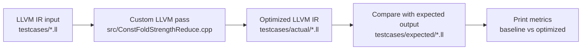

# Constant Folding and Strength Reduction LLVM Pass

## Quick Summary

This repository contains a custom LLVM optimization pass written in C++. The pass reads LLVM IR and performs simple, safe arithmetic optimizations:

1. constant folding for binary integer operations with constant operands,
2. strength reduction for multiplication by powers of two,
3. strength reduction for unsigned division by powers of two,
4. multiplication identity simplification for `x * 0` and `x * 1`.

The intended grading path is:

```bash
./build.sh
./run.sh
```

`./run.sh` also calls `./build.sh`, so for a full build-and-test run this is enough:

```bash
./run.sh
```

## What the Project Optimizes

Example input LLVM IR:

```llvm
define i32 @combined(i32 %x) {
entry:
  %a = add i32 4, 5
  %b = mul i32 %x, 8
  %c = add i32 %b, %a
  ret i32 %c
}
```

Expected optimized LLVM IR:

```llvm
define i32 @combined(i32 %x) {
entry:
  %b = shl i32 %x, 3
  %c = add i32 %b, 9
  ret i32 %c
}
```

In this example:

- `add i32 4, 5` is folded into `9`.
- `mul i32 %x, 8` is replaced with `shl i32 %x, 3`.

## Project Flow



## Repository Layout

```text
.
|-- README.md
|-- DESIGN.md
|-- IMPLEMENTATION.md
|-- EVALUATION.md
|-- CMakeLists.txt
|-- build.sh
|-- run.sh
|-- src/
|   `-- ConstFoldStrengthReduce.cpp
|-- testcases/
|   |-- algebraic_identities.ll
|   |-- combined.ll
|   |-- constant_folding.ll
|   |-- division_strength.ll
|   |-- strength_reduction.ll
|   `-- expected/
|       |-- algebraic_identities.ll
|       |-- combined.ll
|       |-- constant_folding.ll
|       |-- division_strength.ll
|       `-- strength_reduction.ll
|-- frontend/
|-- report/
`-- tests/
```

The official assignment path is `src/`, `testcases/`, `build.sh`, and `run.sh`. The `frontend/`, `report/`, and older `tests/` folders are supplementary material and are not needed to build or grade the LLVM pass.

## Requirements

Use a Linux or WSL environment with LLVM development tools installed.

Required tools:

- `cmake`
- `clang++` or another C++17 compiler
- `opt`
- `llvm-config`
- LLVM CMake package files

Recommended environment:

```text
Ubuntu 22.04 or 24.04
LLVM 16, 17, or 18
CMake 3.16 or newer
```

This project was originally verified with LLVM 18 on Ubuntu 24.04 through WSL.

## Installing Dependencies on Ubuntu or WSL

One typical LLVM 18 setup is:

```bash
sudo apt update
sudo apt install -y cmake ninja-build clang llvm-18 llvm-18-dev llvm-18-tools
```

If your system installs versioned tools only, you may need:

```bash
export PATH=/usr/lib/llvm-18/bin:$PATH
```

Check that the tools are visible:

```bash
cmake --version
llvm-config --version
opt --version
```

## Fresh Clone Instructions

From a fresh clone:

```bash
git clone <repo-url>
cd <repo-folder>
chmod +x build.sh run.sh
./run.sh
```

If `llvm-config` is not available on PATH but LLVM is installed, pass `LLVM_DIR` manually:

```bash
LLVM_DIR=/usr/lib/llvm-18/lib/cmake/llvm ./run.sh
```

The same variable works with the build script:

```bash
LLVM_DIR=/usr/lib/llvm-18/lib/cmake/llvm ./build.sh
```

## Build Script

Run:

```bash
./build.sh
```

What it does:

1. finds the repository root,
2. creates or reuses the `build/` directory,
3. finds LLVM through `LLVM_DIR` or `llvm-config --cmakedir`,
4. configures CMake,
5. builds the LLVM pass plugin.

Successful output creates one of these files:

```text
build/ConstFoldStrengthReducePass.so
build/ConstFoldStrengthReducePass.dylib
build/ConstFoldStrengthReducePass.dll
```

Linux and WSL normally produce the `.so` file.

## Run Script

Run:

```bash
./run.sh
```

What it does:

1. checks that `opt` exists,
2. calls `./build.sh`,
3. runs the pass on each file in `testcases/*.ll`,
4. writes generated output into `testcases/actual/`,
5. compares generated output to `testcases/expected/`,
6. prints a metrics table.

Expected final message:

```text
All testcases matched expected output.
```

Expected total metrics:

```text
TOTAL    base_ops=25    opt_ops=16    base_costly=14    opt_costly=2    shifts=7
```

The script prints these values in a formatted table.

## Manual `opt` Command

The scripts are the required way to run the project, but this is the equivalent manual command for one test case on Linux or WSL:

```bash
opt -load-pass-plugin ./build/ConstFoldStrengthReducePass.so \
  -passes=const-fold-strength-reduce \
  -S testcases/combined.ll -o testcases/actual/combined.ll
```

## Test Cases

The repository includes five required test cases:

| Test case | What it checks |
| --- | --- |
| `constant_folding.ll` | Constant `add`, `mul`, and `sub` fold into one return value |
| `strength_reduction.ll` | Multiplication and unsigned division by powers of two become shifts |
| `combined.ll` | Constant folding and strength reduction work together |
| `algebraic_identities.ll` | `x * 0`, `x * 1`, constants, and shifts in one function |
| `division_strength.ll` | Safe unsigned division is rewritten; unsafe/non-power/signed division stays |

## Documentation Files

- `DESIGN.md` explains the chosen approach and alternatives.
- `IMPLEMENTATION.md` explains the LLVM APIs and pass structure.
- `EVALUATION.md` explains the metrics, baseline comparison, and test cases.

## Troubleshooting

If `./run.sh` says `opt was not found on PATH`, install LLVM tools or add LLVM to PATH:

```bash
export PATH=/usr/lib/llvm-18/bin:$PATH
```

If `./build.sh` says `LLVM_DIR is not set and llvm-config was not found`, either install `llvm-config` or run:

```bash
LLVM_DIR=/usr/lib/llvm-18/lib/cmake/llvm ./build.sh
```

If the shell says `Permission denied`, run:

```bash
chmod +x build.sh run.sh
```

If CMake cannot find LLVM, confirm this path exists:

```bash
ls /usr/lib/llvm-18/lib/cmake/llvm
```

If your LLVM version is different, adjust the path, for example:

```bash
LLVM_DIR=/usr/lib/llvm-17/lib/cmake/llvm ./run.sh
```

## Notes for Reviewers

The important files for grading are:

- `src/ConstFoldStrengthReduce.cpp`
- `build.sh`
- `run.sh`
- `testcases/`
- `README.md`
- `DESIGN.md`
- `IMPLEMENTATION.md`
- `EVALUATION.md`

Generated folders such as `build/` and `testcases/actual/` are intentionally ignored by git.
